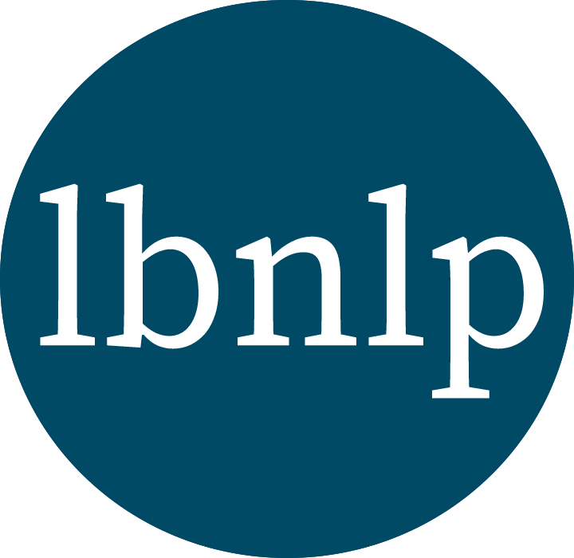

## LBNLP
##### Lawrence Berkeley National Lab Natural Language Processing
###### Common text mining tools for materials science and chemistry, for groups at Lawrence Berkeley National Lab (LBNL) and beyond.

#### Warning: This package is being migrated/condensed from several source repos. It is non-working at the moment. This warning will be removed when it is ready for public usage.

- [Documentation](https://lbnlp.github.io/lbnlp)
